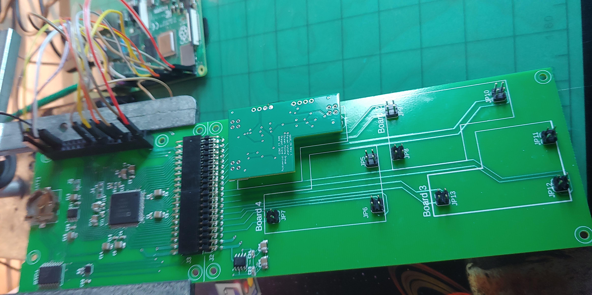

# Oregon State University Ice Ocean group T-rake data acquisition

The Temperature Rake acquisition board acquires high-resolution high-speed measurements from an instrument that houses up to 16 termistors.  The acquisition board features:
- An Analog Devices AD7616 A/D converter that converts 16 channels of analog input with 16-bit resolution at up to megahertz rates.
- A Raspberry Pi computer to control the A/D converter chip and capture acquired data in a file.
- Mounting points for up to four precision thermistor signal conditioning boards, which provide 0-5V signals for up to four thermistors each.
- Optionally, the acquisition board can be manufactured by shearing the A/D converter section from the thermistor input section, allowing the A/D converter to be used for other data acquisition purposes.

<figure>
  
  <figcaption>The Temperature Rake acquistion PCB in development, with one thermistor conditioning board attached</figcaption>
</figure>

## General Connections

The Temperature Rake (t-rake) acquisition board provides the A/D converter chip and a battery-backed real-time clock chip to the GPIO pins of a Raspberry Pi.  The version of the Pi is not specific, but at this time, it has only been tested with a Pi 4B.  Future work will be done to validate it with smaller versions, possibly down to Pi Zero.

The Raspberry Pi fits its GPIO header pins into a socket in the upper right of the t-rake acquisition board, with the Pi face down.  Power must be provided to the Pi, which uses the GPIO pins to power the t-rake acquisition board.

The lower portion of the t-rake acquistion board is designed to accept up to four thermistor conditioning boards, which convert the thermistor output to a 0-5V signal.  Thus, each of the four boards sends four 0-5V signals to the connector J2, which is permanently plugged into J1 and from there to the A/D chip.

The A/D chip is bipolar,meaning each channel has two signal pins, and the value for that channel is the difference between its positive and negative pins.  To achieve full scale with the 0-5V signal, the thermistor carrier board also provides a precision 2.5V reference voltage to the negative side of all channels.  Thus, the A/D converter sees a signal that is (0 - 2.5) = -2.5V at the low end to (5 - 2.5) = 2.5V at the high end.

By placing the A/D channels in a +/- 2.5V range, this signal is appropriate to give a full scale conversion.  All 16 bits of resolution provide meaningful data.

Of course, the 16-bit value converted by the A/D chip is a signed range of -32768 - 32767, so a little arithmetic must be applied to add 32768 to it, resulting in an unsigned range of 0 - 65535.

## Low Level C driver
The AD7616 A/D converter chip provides several channels of data acquisition, including a parallel mode and a Serial Peripheral Interface (SPI) mode.  The SPI mode was chosen to minimize the number of connections needed.

The SPI serial mode allows two pathways, both of which present problems with the Raspberry Pi hardware.  
1. 2-wire SPI.  The AD7616 A/D chip is really two A/D converters operating in parallel.  The fastest way to get the conversion values out of the chip using SPI is to signal it to send the A side conversions over one MISO pin, and the B side conversions over a second MISO pin.  This ability to use two MISO pins, both clocked by the same SCLK, is not standard SPI, but can be  eumulated with a bit-banged approach.  
2. 1-wire SPI.  Alternatively, the A/D chip may be configured to send both A side and B side conversions over a single MISO pin.  While this is standard SPI, it requires using the SPI interface with a 32-bit word length.  Unfortunately, due to limitations in either the Raspberry Pi SPI hardware or the driver software, only 8-bit word lengths are allowed.

After best attempts to get either of the above modes to work with SPI hardware, it was determined that the best approach is to bit-bang four Raspberry Pi GPIO pins in software.  This was attempted in Python, but was 25-50 times too slow for the requirements.  Thus, the bit-bang layer is implemented in the C file.

The strategy is to build this C file as a loadeable library, ad7616_driver.so, which can easily be called from either C, C++, or Python programs.

The C library also provides a multi-threaded data acquistion mode where it continuously starts conversions on a precise clock tick, acquires those conversion results, and captures them into a data file.

The C driver program file is [here](src/ad7616_driver.c)

## Python Programming Interface
Although it is possible to write a Python program to directly interact with the C driver using ctypes, it makes sense to hide these messy details in an API layer.  This simplifies Python programming when controlling the A/D converter in the t-rake acquisition board.

An overview of the Python API layer is [here](docs/PythonAPI.md).

The actual Python implementation of the API is [here](src/ad7616_api.py).

## Data Acqusition File
The C driver library is capable of spinning up a background thread to acquire data from the acquisition board on a precise millisecond period, and write the acquired data to a file.

The format of this file is discussed [here](docs/FileFormat.md).

There is very little error checking in the two layers of software, to keep it lean.  Instead, several conventions are expected to be followed:
- Before calling Start() in the Python API to start data acquisition, you must have previously set up the channels to acquire by calling DefineSequence().  Calling Start() without this setup is undefined.
- Do not make calls to the single-channel ConvertPair() API method after defining channels with DefineSequence().  The channels specified in ConvertPair() will be ignored, and the first two defined in DefineSequence() will be used instead.
- Do not make any calls to the API after calling Start().  The only call allowed while data acquisition is running is Stop().
- The Start() API method allows you to provide a path and file name to use for the acqusition run.  Data will be written to this file until Stop() is called.  It is expected that the file name will be based on the time stamp in some way, to make the file unique.  This file name will also appear in the CSV data file, providing the base time from which all sample ticks depend.  The ticks for each sample are in milliseconds since the start, so having the time stamp in the file allows post-processing to extract the exact time to the millisecond for each sample.

